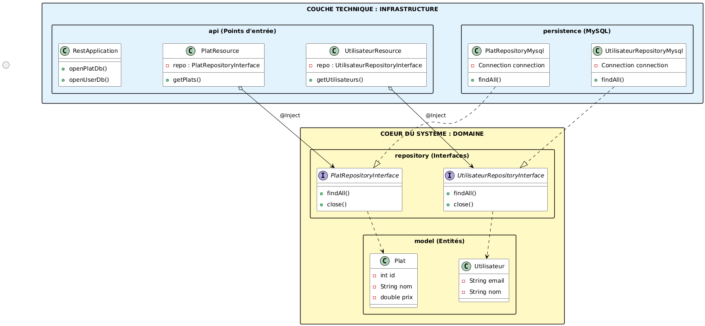

## R4.01 Architecture Logicielle
## Projet -- Mise en pratique du patron Microservices

[Voir les consignes du projet](./Projet.md)

Consulter la javadoc
```bash
javadoc -d docs -sourcepath src/main/java -subpackages fr.univamu.iut.serviceplatsutilisateurs
open docs/index.html
```
### Mohamed : API Plats et Utilisateurs




### Hicham : API Menus
### Sofien : API Commandes

